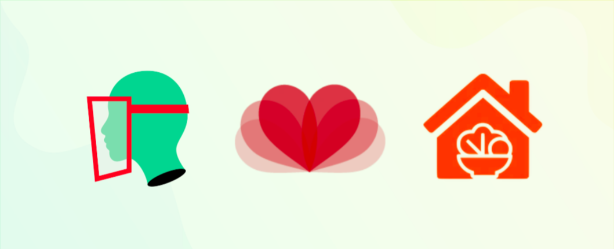

# SUM - Covid Solidarity

As we face the impending meltdown of public \(and private\) health infrastructure due to the COVID-19 pandemic, thousands of independent projects are emerging and struggling to make a difference.

This grant campaign aims to help fund 3 projects, each tackling different angles of critical public health COVID-19 response: **medical supplies**, **mental health** and **food support**.

1. **@**[**MakersContraCovid**](http://makerscontracovid.net.br/) is an autonomous group of volunteers who mobilized the prototyping of 3d printed faceshields for healthcare professionals. We recently validated a new 3d model \(better fit for ICU procedures\), released it [here](https://www.prusaprinters.org/prints/28108-viva-sus-v1), and now preparing mass production with injection mold. Hundreds of faceshields are being delivered to hospitals all over Brazil and the 3d files can be used worldwide.

2. [**Liberadores**](https://www.liberadores.org/) is an international platform to help connect vulnerable people \(like healthcare volunteers and prejudiced minorities\) with professional therapists for emergency psychological care. Developed by activists, for portuguese and spanish speakers, with sessions both free and for symbolic fees.

3. [**Vegg@Home**](https://www.veggathome.com/) is an international food experience platform focused on supporting affected food businesses such as small street food businesses, restaurants and cafes. The platform offers them options for food delivery, food collection \(pick-up\) and free food for vulnerable groups, besides donating resources to NGOs and other projects. We are currently a member of the CFS - Committee on World Food Security - UN.

Funds will be split evenly between them \(minus fees\) and receipts will be posted both here and in a future gitbook for open accountability.

I am **Pedro Parrachia**, passionate about the underlying structures of collective direct action for the common good. Contributor to the 3 projects presented here, member of DAOincubator, ECSA and Rhizom \(and [Origem](http://demo.origem.me/), Rhizom’s own response to the pandemic\), and contributed to a number of other Web3 projects such as Faircoop, GenesisDAO and Blockchain Research Network.

